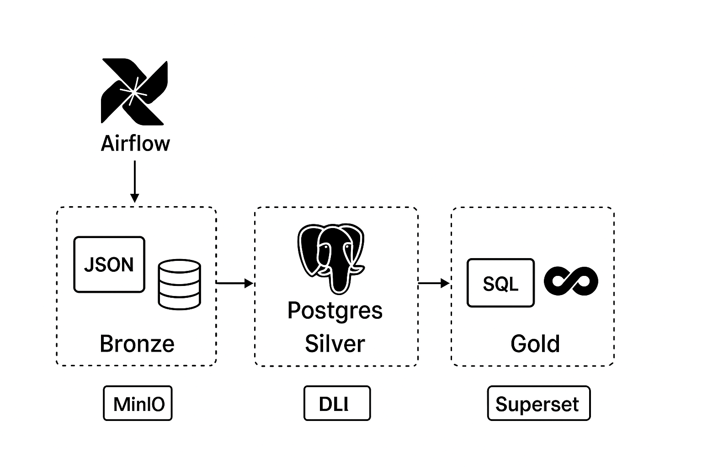

# NBA Spurs ETL Pipeline

Este proyecto implementa un pipeline completo de **Extracción, Carga y Transformación (ETL/ELT)** para datos de los *San Antonio Spurs*, usando una arquitectura moderna con:

- **Apache Airflow** para orquestar el flujo (Bronze → Silver → Gold)  
- **MinIO** como almacenamiento de archivos **Bronze** (JSON)  
- **PostgreSQL** para la capa **Silver** (raw)  
- **dbt** para transformaciones analíticas (capa **Gold**)  
- (Opcional) **Superset** como capa de visualización BI

---

###  Arquitectura general





**Descripción del flujo**:

1. **Bronze (Raw data)**  
   - DAG en Airflow que:
     - Consume la API de la NBA (`nba_api`)  
     - Genera JSON: `games.json`, `players.json`, `teams.json`, `salaries.json`, etc.  
     - Almacena esos archivos en MinIO

2. **Silver (Cleaning / Staging)**  
   - Descarga los JSON de MinIO  
   - Inserta los datos en tablas PostgreSQL sin transformación  
   - El modelo raw queda listo para análisis y transformación

3. **Gold (Analytics / BI)**  
   - Usa **dbt** para aplicar lógica:
     - Cálculos por temporada (local vs visitante)  
     - Ranking de mejores jugadores  
     - Identificación de puntos débiles del equipo  
   - Produce tablas analíticas en `schema: gold` dentro de Postgres

4. **Visualización / Reporting** (opcional)  
   - Conectar Superset a la base Postgres `gold`  
   - Crear dashboards accesibles vía web

---

###  Primeros pasos (Getting Started)

1. Clonar el repositorio  
   ```bash
   git clone https://github.com/Andrestuc79/nba-spurs-etl.git
   cd nba-spurs-etl

